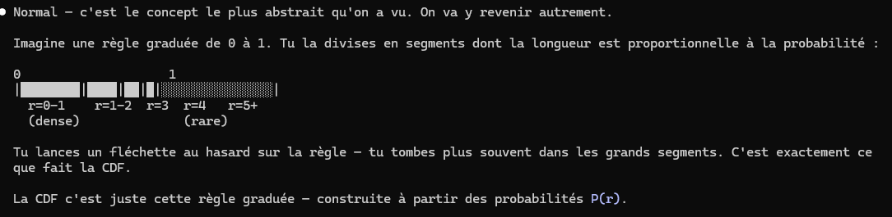

**Un peu de physique**

On a commencé par calculer la distance d'un point à l'origine (0, 0, 0)

Pour l'état fondamental de l'hydrogène (n=1), la densité de probabilité est :
P(r) = e^(-2r/a₀)
Où a₀ = 0.529 Å (rayon de Bohr — unité de distance en physique atomique).

Particle(x=0, y=0, z=0, charge=1, probability=1, distance_from_origin=0)
Particle(x=1, y=1, z=1, charge=2, probability=0.0014324111, distance_from_origin=1.7320508)
Particle(x=2, y=2, z=2, charge=3, probability=0.0000020518019, distance_from_origin=3.4641016)

Les valeurs sont physiquement correctes :

  - r=0 → P=1.0 : l'électron est le plus probable au noyau
  - r=1.73 → P=0.0014 : probabilité qui chute rapidement
  - r=3.46 → P=0.000002 : quasi zéro à distance

C'est la décroissance exponentielle de la fonction d'onde hydrogène — tu viens de simuler de la vraie mécanique quantique.

Les coordonnées sphériques permettent de décrire la position d'un électron autour du noyau avec trois valeurs :

  - r — distance au noyau (tu l'as déjà calculée)
  - θ (theta) — angle polaire (de 0 à π)
  - φ (phi) — angle azimutal (de 0 à 2π)

  Maintenant les nombres quantiques. Ils définissent l'état de l'électron :

| Symbole | Nom        | Valeurs    |
---------|------------|------------|
| n       | principal  | 1, 2, 3... |
| l       | orbital    | 0 à n-1    |
| m       | magnétique | -l à +l    |

Pour n=1 tu as l=0, m=0 — c'est l'état fondamental qu'on a simulé.
Pour n=2 tu as l=0,1 et m=-1,0,1 — orbitales 2s et 2p.

Le C++ utilise deux polynômes séparément :

  1. Laguerre → partie radiale (dépend de r et de n, l)
  2. Legendre → partie angulaire (dépend de θ et de l, m)

  La probabilité complète combine les deux :
  P(r, θ) = R(r)² × |Y(θ, φ)|²

  C'est ce qu'on va porter en Rust. On commence par Laguerre.

  Le C++ calcule le polynôme de Laguerre par récurrence — chaque valeur dépend des deux précédentes. C'est un algorithme
   itératif, pas une formule directe.

comprendre ce qu'on calcule avant de continuer.

  ---
  Laguerre — partie radiale

  Il répond à : "à quelle distance du noyau l'électron a-t-il des chances d'être ?"

  rho = 2r / (n * a0) normalise la distance selon le niveau d'énergie n. Plus n est grand, plus l'électron est loin.

  Le polynôme de Laguerre module cette distance — il crée des couches (les nœuds radiaux). Pour n=1 l'électron est
  concentré près du noyau. Pour n=2 il y a une zone vide entre deux couches de probabilité.

  En pratique dans le code : laguerre(n-l-1, 2l+1, rho) — les paramètres k et alpha sont déterminés par n et l.

  ---
  Legendre — partie angulaire

  Il répond à : "dans quelle direction autour du noyau l'électron a-t-il des chances d'être ?"

  cos(θ) est l'angle par rapport à l'axe z. Legendre donne la forme de l'orbitale en 3D :

  - l=0 → orbitale s : sphère, probabilité identique dans toutes les directions
  - l=1 → orbitale p : forme en haltère, concentrée sur un axe
  - l=2 → orbitale d : forme en trèfle à quatre feuilles

  m choisit l'orientation de cette forme dans l'espace.

  ---
  Résumé visuel :

  P(r, θ) = [Laguerre → à quelle distance]² × [Legendre → dans quelle direction]²

  la densité de probabilité à une position (r, θ). Pas un emplacement fixe, mais la probabilité de
  trouver l'électron à cet endroit. P(r, θ) = R(r)² × Y(θ, φ)²

  C'est ça que tu calcules dans compute_probability().

En RUST :

fn compute_probability(&mut self) {
        let a0 = 0.529_f64;
        let r = self.distance_from_origin() as f64;
        let rho = 2.0*r / (self.n as f64 * a0);

        let l_val = laguerre(self.n - self.l - 1, 2 * self.l + 1, rho);
        let big_r = f64::exp(-rho / 2.0) * rho.powi(self.l) * l_val;

        let cos_theta = (self.z as f64) / r.max(1e-10);
        let y_val = legendre(self.l, self.m.abs(), cos_theta);

        self.probability = (big_r * big_r * y_val * y_val) as f32;
    }

Actuellement compute_probability() calcule la probabilité à une position donnée. Pour simuler un électron, on veut
  l'inverse : générer une position aléatoire qui respecte la distribution de probabilité.

  Le problème : on ne peut pas tirer au hasard uniformément — l'électron est plus souvent près du noyau que loin. Il
  faut un tirage biaisé selon la densité de probabilité.

  La solution : Monte Carlo avec CDF.

1. On découpe r en N intervalles (0 à r_max)
2. On calcule P(r) pour chaque intervalle → c'est le PDF
3. On cumule ces valeurs → c'est la CDF (elle va de 0 à 1)
4. On tire un nombre aléatoire u entre 0 et 1
5. On cherche le r où CDF(r) = u → c'est notre position

C'est exactement ce que fait sampleR dans le C++. Le rejection sampling peut rejeter 99% des tirages pour des orbitales diffuses. La CDF garantit un tirage
utile à chaque fois.

1. Pourquoi multiplie-t-on par r² dans le PDF ?
- Le facteur r² vient du volume d'une coquille sphérique : dV = 4πr² dr. Plus on est loin du centre, plus il y a de "place" dans l'espace. Sans ce facteur on       sous-estimerait les grandes distances.
2. Pour l'étape 3, comment trouver l'indice où CDF[i] >= u selon toi ?
- En pratique on utilise une recherche binaire plutôt qu'un filter linéaire — la CDF est triée, donc on peut trouver l'indice en O(log N) au lieu de O(N). En Rust :
let idx = cdf.partition_point(|&v| v < u);

Affichage : 

c'est du code de setup qui suit une recette, pas quelque chose qu'on comprend en le lisant. Voici ce que chaque ligne fait concrètement :

  GLFW — gère la fenêtre et les inputs (clavier, souris). C'est lui qui crée la fenêtre OS.
  glfw::init(...)          // démarre la bibliothèque
  create_window(...)       // crée la fenêtre
  window.make_current()    // dit "cette fenêtre est la cible OpenGL active"
  window.set_key_polling() // active la réception des événements clavier
  poll_events()            // lit les événements depuis l'OS

  GL — c'est OpenGL lui-même, qui dessine dans la fenêtre. Mais OpenGL sur Windows ne se charge pas tout seul — ses
  fonctions sont dans les drivers GPU, pas dans des DLL standard.
  gl::load_with(|s| ...)  // pour chaque fonction OpenGL (ClearColor, DrawArrays...),
                           // demande à GLFW où elle se trouve dans le driver

  Le match qu'on vient d'ajouter : certaines fonctions n'existent pas sur tous les GPU, donc get_proc_address retourne
  None → on donne un pointeur nul à la place.

  gl::ClearColor(...)  // dit quelle couleur utiliser pour effacer
  gl::Clear(...)       // efface l'écran
  swap_buffers()       // affiche ce qu'on vient de dessiner (double buffering)

  Est-ce que ça compile maintenant ?

Maintenant on va afficher les points de l'électron. Le principe OpenGL pour dessiner des points :

  1. Générer N positions avec sample_position()
  2. Les mettre dans un tableau de flottants (Vec<f32>)
  3. Envoyer ce tableau au GPU via un VBO (Vertex Buffer Object)
  4. Dire à OpenGL de les dessiner comme des points

le GPU est conçu pour traiter des milliers de points en parallèle. Si on dessinait depuis le CPU, on
enverrait les données point par point à chaque frame. Avec un VBO, on envoie tout en une fois au début, et le GPU
dessine directement depuis sa mémoire à chaque frame.

Actuellement les points sont projetés à plat — pas de perspective, pas de rotation. Pour donner une vraie vue 3D il
faut une matrice de transformation qui convertit les coordonnées 3D en coordonnées écran.

Le pipeline classique :
position 3D → Model → View → Projection → écran

On va utiliser la crate glm pour les maths matricielles

Reprise du J3 au J7 :

Tu as converti des coordonnées cartésiennes (x, y, z) en coordonnées sphériques (r, θ, φ). Donne-moi les trois formules de conversion.

r_orig = f32::sqrt(self.x.powi(2) + self.y.powi(2) + self.z.powi(2)) = √(x² + y² + z²)
phi    = f32::atan2(self.y, self.x) = arctan(y / x) → (ALT + 8730) atan2 pour retourner une valeur entre -pi et pi au lieu de -pi/2 pi/2
theta  = f32::acos(self.z / self.distance_from_origin()) = arccos(z / r)

à l'inverse :
x = r * theta.sin() * phi.cos()
y = r * theta.sin() * phi.sin()
z = r * theta.cos()

DCF et MonteCarlo

sample_r génère un r aléatoire qui suit la distribution de probabilité de l'électron. Le problème : si on tire un r au hasard entre 0 et r_max, tous les rayons sont équiprobables — ce n'est pas physique. L'électron est plus souvent proche du noyau.

  La solution en trois étapes :

  1. On découpe r en N intervalles et on calcule la probabilité P(r) pour chaque — c'est le PDF
  2. On cumule ces probabilités de 0 à r_max — c'est la CDF (elle va de 0 à 1)
  3. On tire un nombre aléatoire u entre 0 et 1, et on cherche le r où CDF(r) = u

La CDF monte rapidement là où la probabilité est élevée — donc beaucoup de valeurs de u correspondent à cette zone. Elle monte lentement là où la probabilité est faible — peu de valeurs de u y tombent.
Donc si la CDF monte vite entre 0 et 2 → la majorité des u aléatoires donnent un r entre 0 et 2 → l'électron est souvent près du noyau.

le VBO stocke les coordonnées des points (x, y, z de chaque électron) directement dans la mémoire du GPU.

C'est ça la clé — les données quittent la RAM du CPU pour aller dans la VRAM du GPU. Ensuite le GPU peut les lire directement à chaque frame sans aller chercher dans la RAM.

le VAO mémorise le format des données : "chaque vertex = 3 floats, commençant à l'offset 0". Sans lui, il faudrait redéfinir ce format à chaque frame.

- Model : transforme l'objet dans le monde (rotation, translation, échelle). Dans notre code, c'est la rotation angle
  qui fait tourner l'orbitale.
- View : simule la caméra — où elle est, où elle regarde. Dans notre code, look_at place la caméra à z=15 qui regarde
  vers l'origine.
- Projection : transforme la scène 3D en image 2D avec perspective — les objets lointains paraissent plus petits.
  C'est perspective(fov, ratio, near, far).

DYNAMIC_DRAW :
C'est un hint au GPU sur le pattern d'utilisation :

- STATIC_DRAW : les données sont envoyées une fois et ne changent plus — le GPU peut les optimiser en mémoire lente
- DYNAMIC_DRAW : les données changent fréquemment — le GPU les place en mémoire plus rapide pour faciliter les mises à
   jour

Quand on change d'orbitale, on envoie 10 000 nouvelles positions au GPU. Avec DYNAMIC_DRAW on indique que ce buffer
  sera mis à jour régulièrement, donc le GPU le gère différemment en interne.

Avant de coder, une question : actuellement tous les points ont la même taille et la même couleur peu importe leur distance à la caméra. Dans le projet de référence, les points proches paraissent plus grands et plus lumineux. Comment penses-tu qu'on pourrait implémenter ça ?

c'est dans le vertex shader qu'on peut modifier la taille de chaque point selon sa profondeur. OpenGL a une variable built-in gl_PointSize qu'on peut calculer dynamiquement.

Actuellement dans le vertex shader : gl_Position = mvp * vec4(pos, 1.0);

La position après transformation a une coordonnée w qui représente la profondeur. Plus w est grand, plus le point est loin.

On peut calculer la taille comme :
gl_PointSize = 50.0 / gl_Position.w;

Mais avant ça, il faut activer le depth buffer et GL_PROGRAM_POINT_SIZE côté Rust. Ajoute juste après gl::load_with :

unsafe {
  gl::Enable(gl::DEPTH_TEST);
  gl::Enable(gl::PROGRAM_POINT_SIZE);
}

Improve Visuels : 
1. Rust : fn inferno(x, y, z, n, l, m) -> (f32, f32, f32)
2. generate_positions → stocke 6 floats par point (x,y,z,r,g,b)
3. VAO → 2 attributs : position (loc 0) + couleur (loc 1)
4. Shaders → vertex passe la couleur, fragment l'utilise

1. C'est le port direct du C++ inferno(). Elle calcule la densité de probabilité en (x,y,z), la compresse en log, puis la mappe sur la palette feu.

  Voici la palette feu (6 stops, comme dans le C++) :

  0.0  → (0, 0, 0)       noir
  0.2  → (0.1, 0, 0.2)   violet foncé
  0.4  → (0.6, 0, 0)     rouge
  0.6  → (0.9, 0.4, 0)   orange
  0.8  → (1.0, 0.9, 0)   jaune
  1.0  → (1, 1, 1)       blanc

  Écris d'abord la fonction heatmap_fire qui prend un f32 entre 0 et 1 et retourne (f32, f32, f32).

2. fn inferno

  Cette fonction prend une position (x, y, z) et les nombres quantiques (n, l, m), calcule la densité de probabilité en
  ce point, la compresse en log, et retourne une couleur RGB via heatmap_fire.

3. Modifier generate_positions

Actuellement elle stocke 3 floats par point (x, y, z). Elle doit en stocker 6 (x, y, z, r, g, b). La signature ne change pas, mais le corps oui.

4. VAO et SHADERS

Le VAO lit actuellement 3 floats par vertex. Il faut lui dire que chaque vertex est maintenant 6 floats : (x, y, z, r, g, b)
